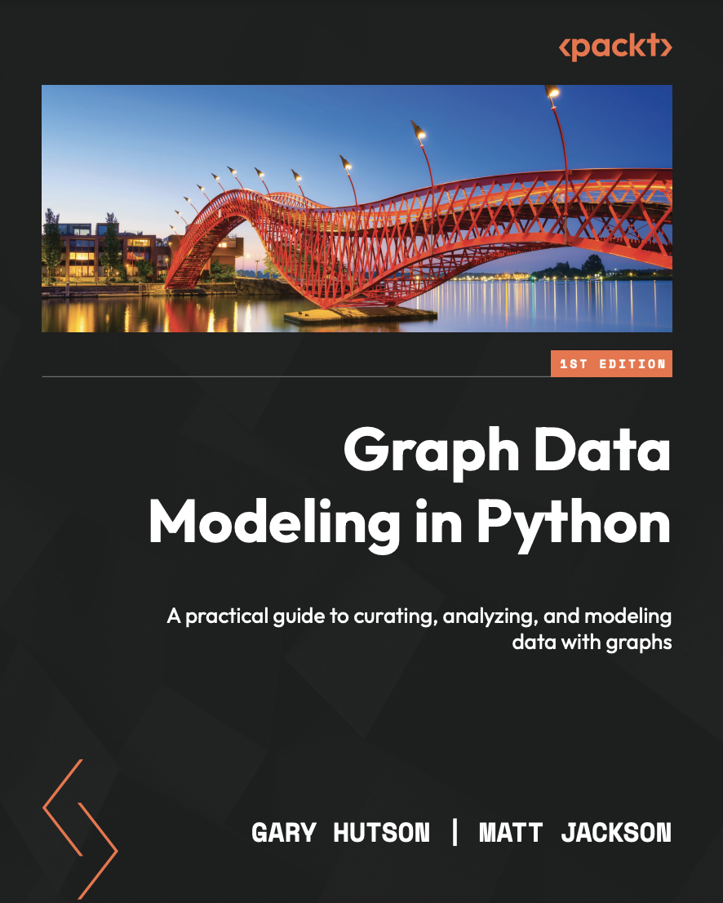

# Graph Data Modeling in Python

@copyright 2023, Packt Publishing, Gary Hutson and Matt Jackson. 

Contact me for any question you have on LinkedIn: https://www.linkedin.com/in/ghutson/ 
[Get the book on Amazon](https://www.amazon.co.uk/Graph-Data-Modeling-Python-practical/dp/1804618039/ref=sr_1_1?crid=3D0FAONTDPZUY&keywords=graph+data+modelling&qid=1688413307&sprefix=graph+data+modelling%2Caps%2C74&sr=8-1)

## Getting started
This will teach you the tricks of the profession from two practising Graph Data Scientists. Learn how to work with graph data, to building recommendation systems using simple and more complicated similarity methods, learn how to work with database technologies such as MySQL and Memgraph. Build a social network knowledge graph and create a recommendation engine which recommends which video games you are likely to play next on the popular platform Steam. From there, we move on to how to develop reproducable graph pipelines, refactor and evolve schemas, create graph projections and learn how to debug some common errors you may see when you start working with graph data. 

## Key Features
- Getting started with graph data modeling - including how to transition from traditional analytical approaches to graph analysis
- Transition from relational data to graph data models, learning the key applications and methodologies along the way
- Apply your knowledge to build up real world use cases, such as the creation of  social media graphs knowledge graphs

## Book Description
Graphs are increasingly being used to power products and services we all use daily, from social media, to online shopping recommendations, and even fraud detection. A good graph data model can make all the difference to solutions and services like these, both increasing efficiency and enabling complex network analysis to uncover hidden insights in your data.
In our book Graph Data Modelling in Python, you will learn how to design, implement and utilize a variety of graph data models, using the open-source Python libraries NetworkX and igraph. Following along with practical use cases and examples,  you’ll find out how to design the ideal graph model to support a wide range of queries and features. You’ll be guided through how to transition from traditional relational databases and tabular data, to graph data structures that allow powerful, path-based analyses. What’s more, you’ll learn how to manage a persistent graph database using Memgraph, and how to manage an evolving network model as your data needs change.
## What you will learn
- Find out how to design graph data models and schema design best practices
- Transition from relational data to graph data modeling
- Work with the best and most current graph frameworks - NetworkX and igraph in Python
- Learn how to store, query, ingest and refactor graph data
- Learn how to store your graphs in memory with Neo4J
- Build and work with projections and put them to work
- Refactor schemas and learn strategies to deal with an evolving graph data model
- Real world use case development and application of methods, such as community detection, knowledge graphs and recommendation networks

## Table of Contents 
1. [Introducing Graphs in the Real World](https://github.com/PacktPublishing/Graph-Data-Modeling-in-Python/tree/main/CH01) 
2. [Working with Graph Data Models](https://github.com/PacktPublishing/Graph-Data-Modeling-in-Python/tree/main/CH02) 
3. [Data Model Transformation - Relational to Graph databases](https://github.com/PacktPublishing/Graph-Data-Modeling-in-Python/tree/main/CH03) 
4. [Build a Knowledge Graph](https://github.com/PacktPublishing/Graph-Data-Modeling-in-Python/tree/main/CH04) 
5. [Working wih Graph Databases and Neo4J](https://github.com/PacktPublishing/Graph-Data-Modeling-in-Python/tree/main/CH05)
6. [Pipeline development](https://github.com/PacktPublishing/Graph-Data-Modeling-in-Python/tree/main/CH06)
7. [Refactoring and evolving schemas](https://github.com/PacktPublishing/Graph-Data-Modeling-in-Python/tree/main/CH07)
8. [Perfect projections](https://github.com/PacktPublishing/Graph-Data-Modeling-in-Python/tree/main/CH08)
9. [Common errors and debugging](https://github.com/PacktPublishing/Graph-Data-Modeling-in-Python/tree/main/CH09)
